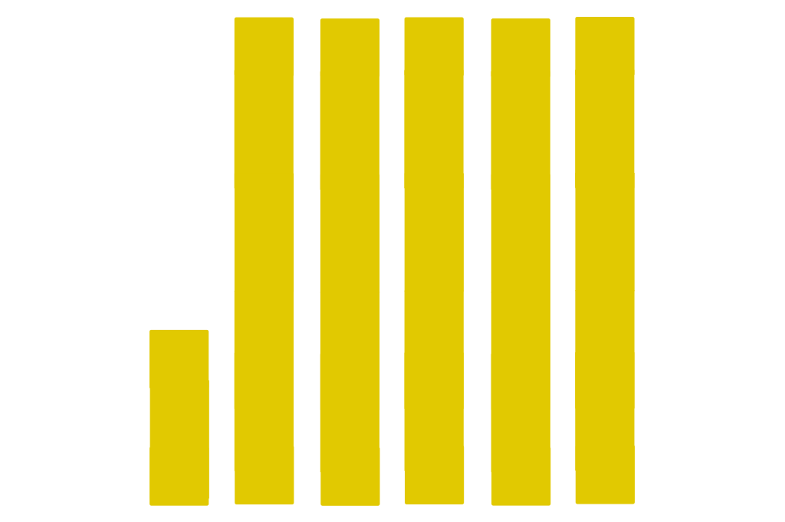

<h1 align="center">Hi 👋, I'm Kirill Nerush</h1>
<h3 align="center">
A python <b><u>developer</u></b> / <b><u>data engineer</u></b> / <b><u>ETL-developer</u></b> from Russia.
</h3>

---
[About me](pages/en/about_me.md)

[Projects_with_me](pages/en/projects_with_me.md)

---
<h3 align="center">My main development stack:</h3>

    
    
     
    

    
    
    
    
    
    
    

    
    
    

    
    
    
    
    
    
    
    
    

    
    
    
    
    
     
    
    

<h3 align="center">My works can be found:</h3>

    
    
    

<h3 align="center">Know about my experiences:</h3>

    
    
   

<h3 align="center">Connect with me:</h3>

    
    

